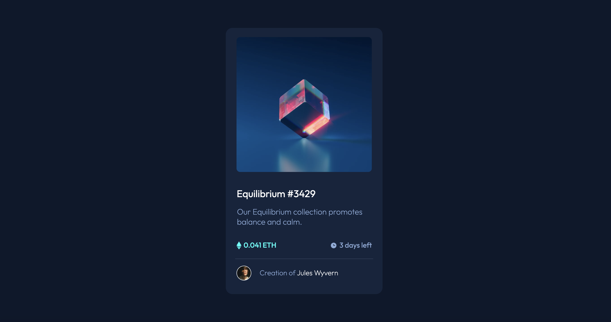

# Frontend Mentor - NFT Preview Card Component solution

This is a solution to the [NFT Preview Card Component challenge on Frontend Mentor](https://www.frontendmentor.io/challenges/nft-preview-card-component-SbdUL_w0U). Frontend Mentor challenges help you improve your coding skills by building realistic projects. 

## Table of contents

- [Overview](#overview)
  - [Screenshot](#screenshot)
  - [Links](#links)
- [My process](#my-process)
  - [Built with](#built-with)
  - [What I learned](#what-i-learned)
- [Author](#author)

## Overview

### Screenshot
### My Solution

### Links

- Solution URL: [Here is the solution on Github](https://github.com/ciesluk/NFT-Card-Component)
- Live Site URL: [Click here to view it live](https://glowing-biscuit-b2a1b6.netlify.app/)

## My process

### Built with

- HTML5 Markup
- CSS3
- Flexbox

### What I learned

I had a review of Flexbox. I also learned about CSS positionig, like relative and absolute which helped with the view icon hover effect.

## Author

- Website - [Tom Cieslukowski](https://www.tomcieslukowski.com)
- Frontend Mentor - [@ciesluk](https://www.frontendmentor.io/profile/ciesluk)
- Instagram - [@ciesluk_codes](https://www.instagram.com/ciesluk_codes/)
